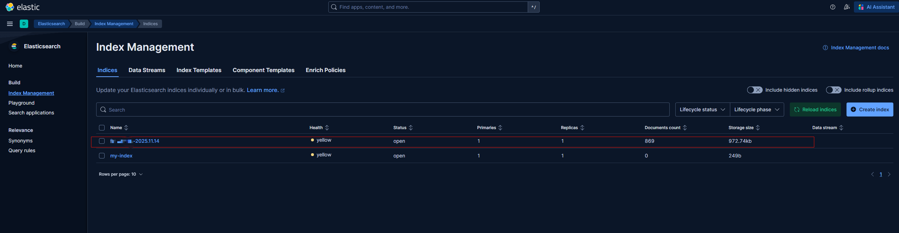
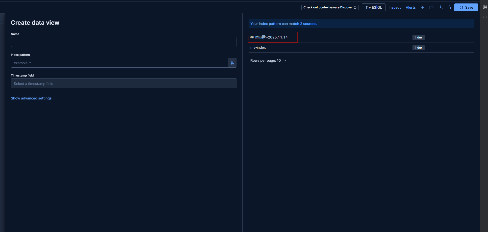
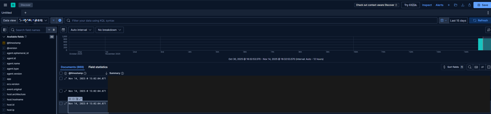

# 前置条件
安装好docker和 docker compose

# 1. compose环境文件夹

```
mkdir elk && cd elk
```

# 2. 创建compose文件

```
vim docker-compose.yaml
```

内容如下
```
services:
  elasticsearch:
    image: docker.elastic.co/elasticsearch/elasticsearch:9.2.0
    container_name: elasticsearch
    environment:
      - discovery.type=single-node  # 单节点模式 
      - xpack.security.enabled=false  # 禁用安全认证（测试用）
      - bootstrap.memory_lock=true
      - ES_JAVA_OPTS=-Xms1g -Xmx1g
    volumes:
      - es_data:/usr/share/elasticsearch/data
    ports:
      - "9200:9200"
    networks:
      - elk

  kibana:
    image: docker.elastic.co/kibana/kibana:9.2.0
    container_name: kibana
    environment:
      - ELASTICSEARCH_HOSTS=http://elasticsearch:9200
    ports:
      - "5601:5601"
    networks:
      - elk
    depends_on:
      - elasticsearch

  logstash:
    image: docker.elastic.co/logstash/logstash:9.2.0
    container_name: logstash
    volumes:
      - ./logstash/config/logstash.conf:/usr/share/logstash/pipeline/logstash.conf
    environment:
      - LS_JAVA_OPTS=-Xms512m -Xmx512m
    ports:
      - "5044:5044"
    networks:
      - elk
    depends_on:
      - elasticsearch

volumes:
  es_data:
    driver: local

networks:
  elk:
    driver: bridge
```

# 3. 创建logstash文件夹及配置
```
mkdir -p logstash/config

echo 'input { beats { port => 5044 } } output { elasticsearch { hosts => ["http://elasticsearch:9200"] } }' > logstash/config/logstash.conf
```


# 4. 启动

```
docker compose up -d
```

# 5. 访问验证

elasticsearch
```
http://localhost:9200/
```
账号：elastic
密码：elastic

kanaba
```
http://localhost:5601/
```

如果要采集某个系统的文件日志信息
可以安装 filebeat ，filebeat 配置信息如下
filebeat.yml
```

filebeat.inputs:
- type: filestream
  id: xiaogu-local-id
  enabled: true
# 采集文件的路径 logstash 中对应配置按照应用划分可以  
  paths:
    - D:\applicationfile\idea\logs\*.log
      fields:
      app: aaa
      fields_under_root: true
# app 是应用名，在
filebeat.config.modules:
path: ${path.config}/modules.d/*.yml
reload.enabled: false

setup.template.settings:
index.number_of_shards: 1

setup.kibana:

output.logstash:
hosts: ["localhost:5044"]

# 你logstash 所在的主机

processors:
- add_host_metadata:
  when.not.contains.tags: forwarded
- add_cloud_metadata: ~
- add_docker_metadata: ~
- add_kubernetes_metadata: ~
```

正常启动之后就会把文件里面的日志采集到 logstash 中，然后 logstash 会把日志发送到 elasticsearch 中


然后就可以使用



